# Expert-Talk

The platform that brings experts and customers together. This application is made with clean architecture approach.

# Screens

<table>
  <tr>
    <th>Intro Page</th>
    <th>Sign-In Page</th>
    <th>Sign-Up Page</th>
    <th>Video Calling Page</th>
  </tr>
  <tr>
    <td>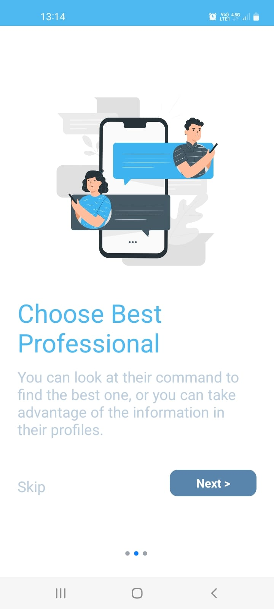</td>
    <td>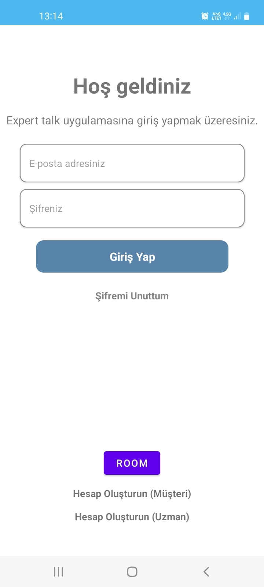</td>
    <td>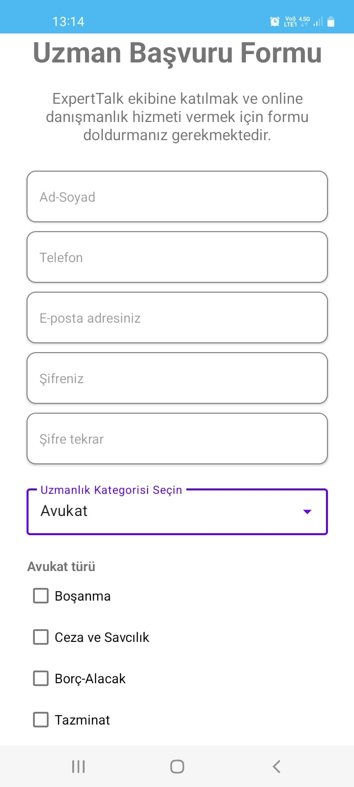</td>
    <td></td>
  </tr>
</table>

<table>
  <tr>
    <th>Home Page</th>
    <th>Message List Page</th>
    <th>Message Page</th>
    <th>Expert Search List Page</th>
  </tr>
  <tr>
    <td>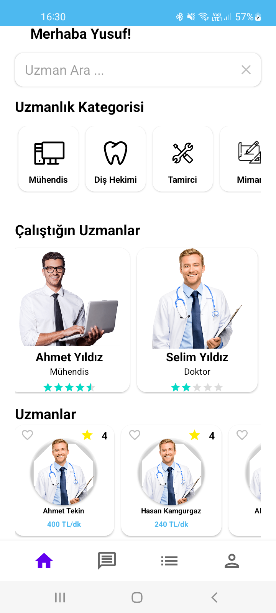</td>
    <td>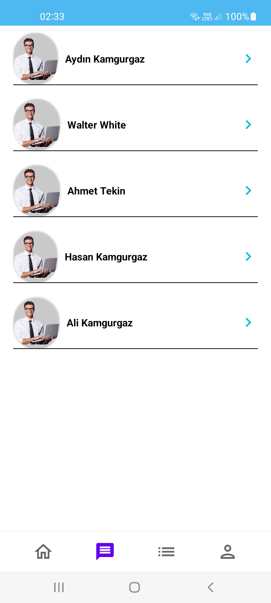</td>
    <td>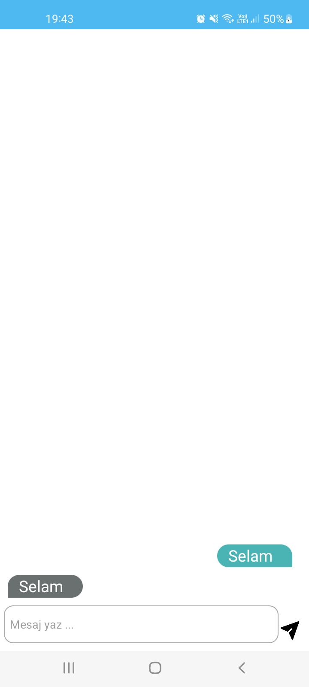</td>
    <td>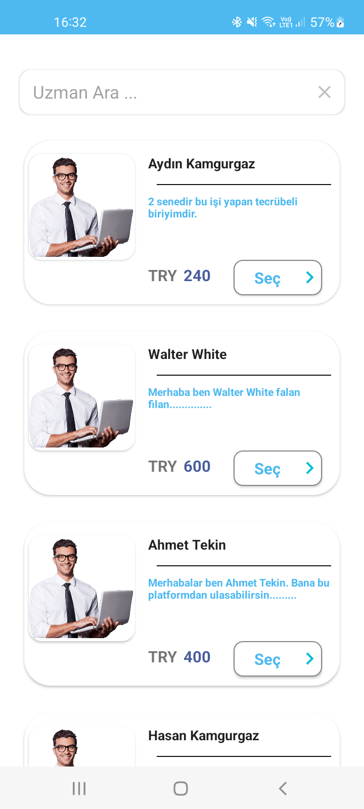</td>
  </tr>
</table>

<table>
  <tr>
    <th>Expert Detail Page</th>
    <th>Expert Appointment Page</th>
    <th>Expert Appointment Time Page</th>
    <th>Expert Appointment Time and Date Page</th>
  </tr>
  <tr>
    <td>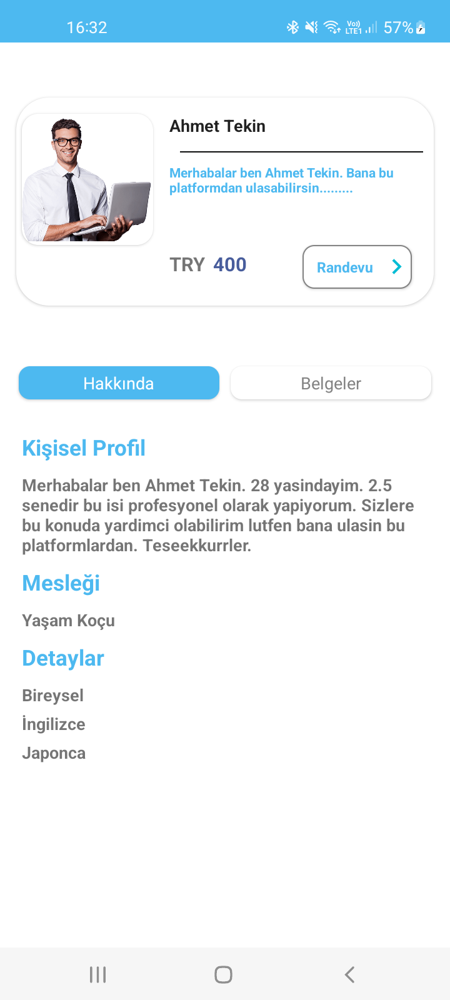</td>
    <td>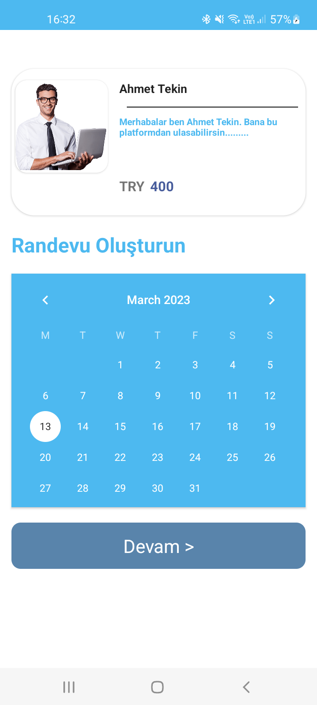</td>
    <td>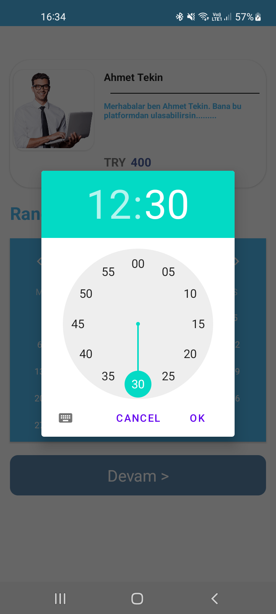</td>
    <td>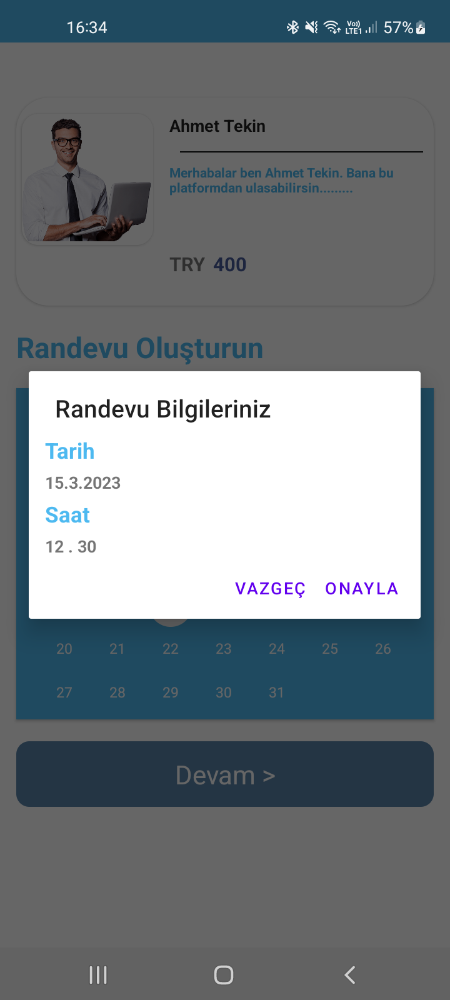</td>
  </tr>
</table>

<table>
  <tr>
    <th>Expert Profile Page</th>
    <th>User Profil Page</th>
  </tr>
  <tr>
    <td>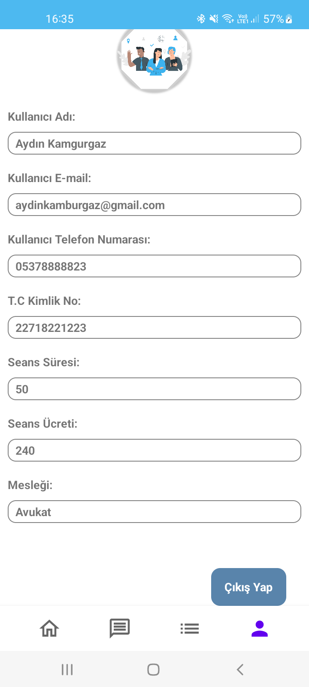</td>
    <td>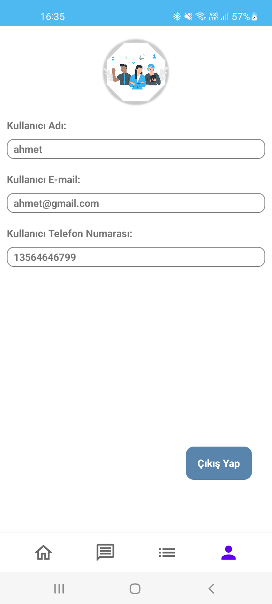</td>
  </tr>
</table>

# Project Tech stack & Open-source libraries

## Android

- [Clean Architecture](https://blog.cleancoder.com/uncle-bob/2012/08/13/the-clean-architecture.html): Clean Architecture is an architectural pattern for designing software systems.
  -Data Layer: While the UI layer contains UI-related state and UI logic, the data layer contains application data and business logic. The business logic is what gives    value to your app—it's made of real-world business rules that determine how application data must be created, stored, and changed.
  -Domain Layer: The domain layer is responsible for encapsulating complex business logic, or simple business logic that is reused by multiple ViewModels. This layer      is optional because not all apps will have these requirements. You should only use it when needed-for example, to handle complexity or favor reusability.
  -UI Layer: The role of the UI is to display the application data on the screen and also to serve as the primary point of user interaction. Whenever the data changes,    either due to user interaction (like pressing a button) or external input (like a network response), the UI should update to reflect those changes. Effectively, the    UI is a visual representation of the application state as retrieved from the data layer.
- [Flow](https://developer.android.com/kotlin/flow) : Flows are built on top of coroutines and can provide multiple values. A flow is conceptually a stream of data that can be computed asynchronously.
- [Shared Preferences](https://www.digitalocean.com/community/tutorials/android-sharedpreferences-kotlin) : If you have a relatively small collection of key-values that you'd like to save, you should use the SharedPreferences APIs. A SharedPreferences object points to a file containing key-value pairs and provides simple methods to read and write them
- [OkHttp](https://square.github.io/okhttp/) : OkHttp is a popular open-source Java library for making HTTP and HTTPS requests. It was developed by Square, the same company that created Retrofit, another popular HTTP client library for Android.
- [Custom View](https://developer.android.com/develop/ui/views/layout/custom-views/custom-components): Android offers a sophisticated and powerful componentized model for building your UI, based on the fundamental layout classes: View and ViewGroup. To start with, the platform includes a variety of prebuilt View and ViewGroup subclasses — called widgets and layouts, respectively — that you can use to construct your UI.
- [Material Design](https://m3.material.io/): Material Design is a design system built and supported by Google designers and developers. Material.io includes in-depth UX guidance and UI component implementations for Android, Flutter, and the Web.
- [MVVM](https://developer.android.com/topic/libraries/architecture/viewmodel): The ViewModel class is a business logic or screen level state holder. It exposes state to the UI and encapsulates related business logic. Its principal advantage is that it caches state and persists it through configuration changes. This means that your UI doesn’t have to fetch data again when navigating between activities, or following configuration changes, such as when rotating the screen.
- [Dagger Hilt](https://developer.android.com/training/dependency-injection/hilt-android) : Hilt is a dependency injection library for Android that reduces the boilerplate of doing manual dependency injection in your project. Doing manual dependency injection requires you to construct every class and its dependencies by hand, and to use containers to reuse and manage dependencies.
- [Retrofit](https://square.github.io/retrofit/): Retrofit is a popular open-source library for Android and Java that makes it easy to consume RESTful web services. It was developed by Square, the same company that created OkHttp, another popular networking library for Android.
- [Navigation](https://developer.android.com/guide/navigation): Navigation refers to the interactions that allow users to navigate across, into, and back out from the different pieces of content within your app. Android Jetpack's Navigation component helps you implement navigation, from simple button clicks to more complex patterns, such as app bars and the navigation drawer.
- [Fragments](https://developer.android.com/guide/fragments) : A Fragment represents a reusable portion of your app's UI. A fragment defines and manages its own layout, has its own lifecycle, and can handle its own input events. Fragments cannot live on their own--they must be hosted by an activity or another fragment. The fragment’s view hierarchy becomes part of, or attaches to, the host’s view hierarchy.
- [Coroutines](https://developer.android.com/topic/libraries/architecture/coroutines) : A coroutine is a concurrency design pattern that you can use on Android to simplify code that executes asynchronously. Coroutines were added to Kotlin in version 1.3 and are based on established concepts from other languages.
  On Android, coroutines help to manage long-running tasks that might otherwise block the main thread and cause your app to become unresponsive. Over 50% of professional developers who use coroutines have reported seeing increased productivity. This topic describes how you can use Kotlin coroutines to address these problems, enabling you to write cleaner and more concise app code.
- [ViewBinding](https://developer.android.com/topic/libraries/data-binding): View binding is a feature that allows you to more easily write code that interacts with views. Once view binding is enabled in a module, it generates a binding class for each XML layout file present in that module. An instance of a binding class contains direct references to all views that have an ID in the corresponding layout.
- [Agora Video Calling Kit](https://www.agora.io/): The Agora Video Calling Kit is a software development kit (SDK) provided by Agora.io that enables developers to add real-time video and voice communication capabilities to their mobile and web applications. The SDK provides a set of APIs that developers can use to create applications that support group video calls, one-on-one video calls, and voice calls.

## Backend

1. [Ktor](https://ktor.io/) : Ktor is an open-source framework for building asynchronous server-side and client-side applications in Kotlin. It was developed by JetBrains, the company behind Kotlin, and is designed to be lightweight, modular, and easy to use.
   - Routing: Ktor provides a routing DSL that allows developers to define HTTP routes and handlers in a concise and intuitive way.
   - HTTP and HTTPS support: Ktor supports both HTTP and HTTPS protocols, and includes built-in support for SSL/TLS encryption
   - Content negotiation: Ktor supports content negotiation, allowing clients to request data in different formats (such as JSON or XML).
   - Client-side HTTP requests: Ktor includes a client-side HTTP engine that makes it easy to perform HTTP requests from within an application.
   - WebSockets support: Ktor includes built-in support for WebSockets, allowing developers to build real-time applications and push notifications.
   - Authentication and authorization: Ktor provides support for authentication and authorization using a variety of mechanisms, including OAuth 2.0 and JSON Web Tokens (JWT).
  
2. [MongoDb](https://www.mongodb.com/) : MongoDB is an open-source NoSQL document-oriented database system that allows for flexible and scalable storage of data. 
   - Flexible data model: MongoDB's document data model allows for the storage of any type of data, regardless of its structure or schema.
   - High scalability: MongoDB can be easily scaled horizontally across multiple servers, allowing for high availability and fault tolerance.
   - High performance: MongoDB is designed to be fast and efficient, with built-in support for indexing, sharding, and replication.
   - Rich query language: MongoDB supports a rich query language that allows for complex queries and advanced filtering.
   - Geospatial support: MongoDB includes built-in support for geospatial queries, allowing for the storage and retrieval of location-based data.
   - Aggregation framework: MongoDB's aggregation framework allows for complex data analysis and reporting, including grouping, filtering, and aggregation.
   
3. [Postman](https://www.postman.com/): Postman is a popular tool for testing and working with APIs. It is a collaborative platform that enables developers to design, build, and test APIs quickly and easily. Postman simplifies the process of working with APIs by providing a user-friendly interface for sending requests and viewing responses.
   - Send requests: Postman makes it easy to send HTTP requests to APIs and view the responses. Developers can choose from a variety of request types, including GET, POST, PUT, DELETE, and more.
   - Test APIs: Postman includes features for testing APIs, such as automated testing and assertion testing, which help ensure that APIs are working as expected.

